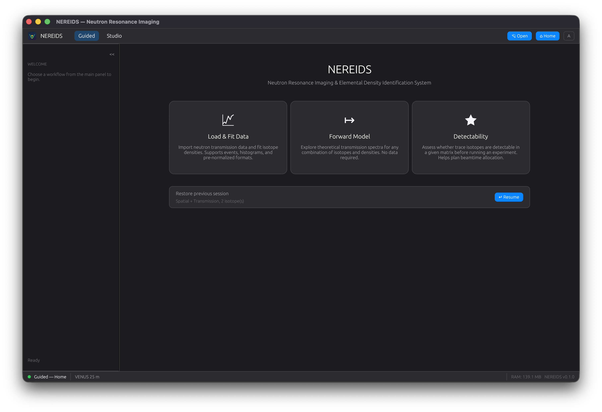
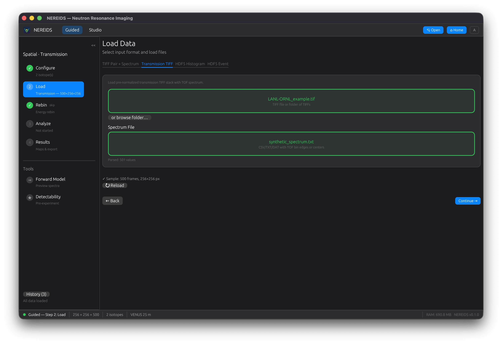
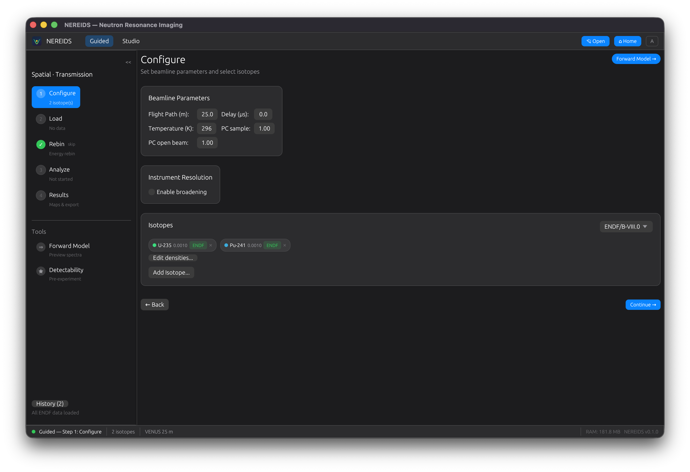
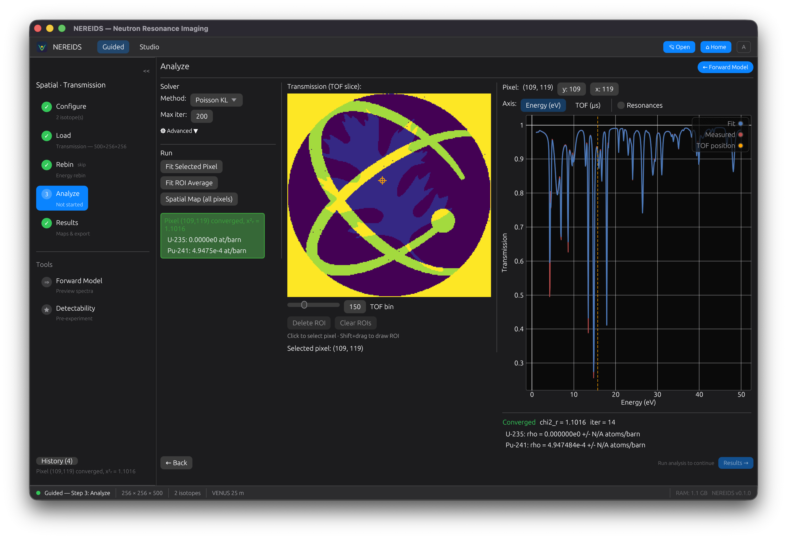
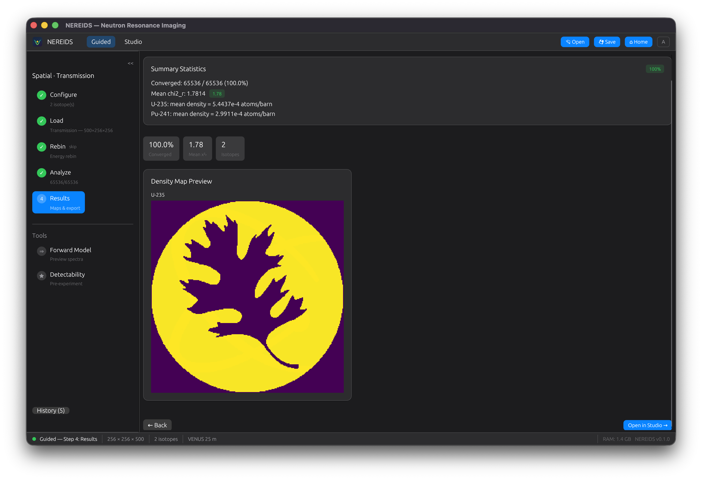
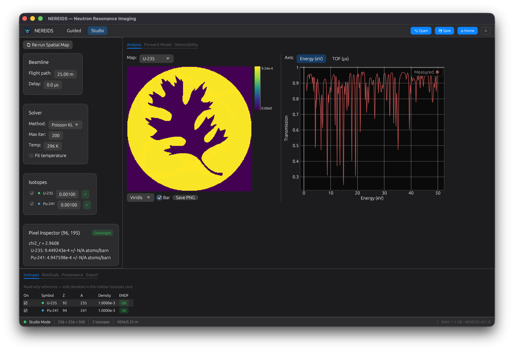
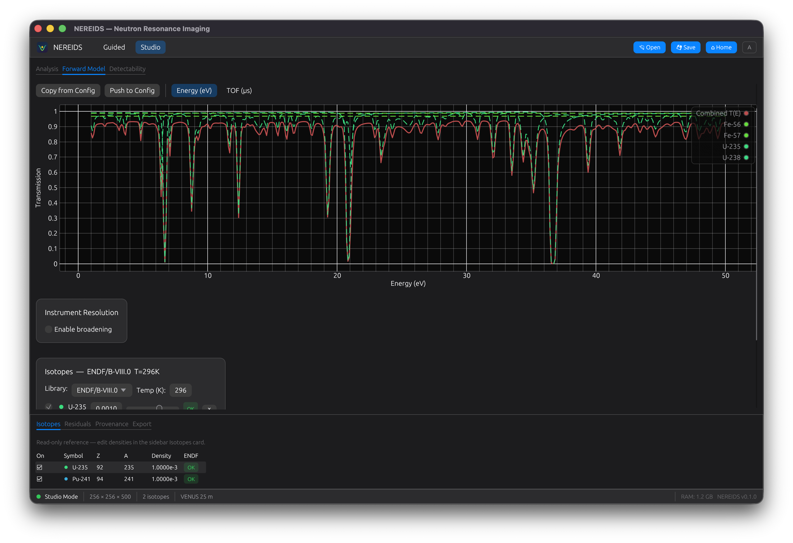
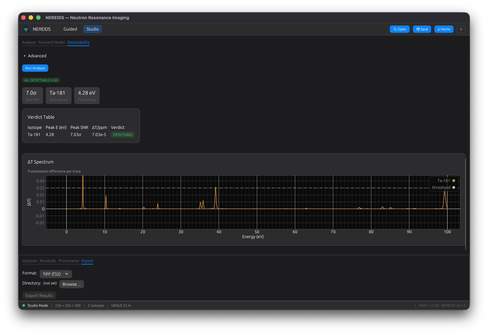
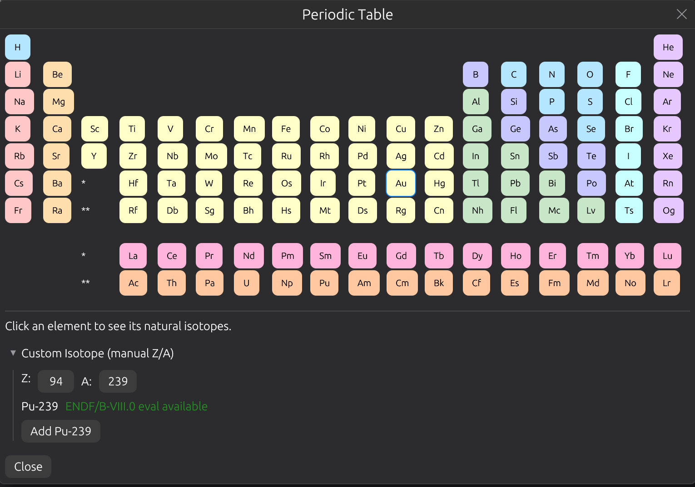

# GUI Walkthrough

The NEREIDS desktop application provides interactive neutron resonance imaging
analysis with visual feedback at every step.

## Launch

```bash
# Homebrew (macOS)
brew install --cask ornlneutronimaging/nereids/nereids

# Or pip
pip install nereids-gui
nereids-gui

# Or from source
cargo run --release -p nereids-gui
```

## Landing Page

The landing page presents three entry points:

- **Single Spectrum** -- fit a single transmission spectrum to recover isotope densities
- **Spatial Map** -- fit every pixel in a transmission image stack
- **Tools** -- forward model, detectability analysis, periodic table



## Decision Wizard

After selecting an entry point, a short wizard asks:

1. **Fitting type**: Single spectrum or spatial map
2. **Data format**: Raw events (NeXus), pre-normalized TIFF, or transmission TIFF

The wizard configures a dynamic pipeline with only the steps relevant to your
data format. Six distinct pipelines are available.

## Pipeline Steps

### Load

Select sample data, open beam, and spectrum files. Supports multi-frame TIFF
stacks, TIFF folders, and NeXus/HDF5 event data. The GUI auto-detects the
file format and loads data when all fields are filled.



### Normalize

For raw data pipelines (TIFF pair or NeXus events), the Normalize step computes
transmission from sample and open-beam measurements. Pre-normalized and
transmission TIFF pipelines skip this step automatically.

### Configure

Select isotopes of interest from the periodic table. ENDF nuclear data is
fetched automatically from IAEA servers and cached locally. Each isotope shows
a status badge (Pending, Fetching, Loaded, Failed).

Configure beamline parameters (flight path, timing resolution) and solver
settings (Levenberg-Marquardt or Poisson KL divergence).



### Analyze

Run the fit. For spatial maps, a progress bar tracks per-pixel fitting with
rayon parallelism. Click any pixel to inspect its individual fit. Fit feedback
shows green (good fit) or red (failed) status.

Draw regions of interest (ROI) with Shift+drag. Multiple ROIs are supported
with move, select, and delete operations.



#### Restricting the fit energy range (SAMMY REGION)

By default NEREIDS fits the entire loaded energy grid. The advanced solver
panel exposes a **"Restrict fit energy range"** checkbox (SAMMY REGION
equivalent — `MIN ENERGY` / `MAX ENERGY` SAM52 cards) that limits the cost
function to a user-specified `[E_min, E_max]` window in eV. Common uses:

- **Resolved-resonance region only** — exclude the unresolved-resonance and
  high-energy tails where the model can't fit;
- **Single resonance triplet** — focus on a specific feature for fine-grained
  density / temperature work;
- **SAMMY parity** — match the REGION restriction used in a reference SAMMY
  fit so the comparison is apples-to-apples.

When the checkbox is on, two grey dashed vertical lines on the spectrum plot
mark the active boundaries (visible on the energy-eV axis). The reduced χ²
and degrees-of-freedom reported in the fit details count only bins inside
the active range.

**Resolution-kernel margin (automatic):** the broadening kernel pulls model
contributions from outside the user range. NEREIDS handles this transparently
by extending the data slice by ~5×FWHM on each side and masking the cost
function back to `[E_min, E_max]` — so resonances near the boundaries are
correctly broadened without the user picking a custom margin. SAMMY user
manual §IIID.6 recommends 3–5×FWHM; we use 5× for safety.

The setting persists in `.nrd.h5` project files (`Option<(f64, f64)>`,
default `None` = full grid for backwards compatibility).

### Results

View density maps for each fitted isotope. Summary statistics show convergence
rate, median chi-squared, and isotope count. Open results in Studio for
detailed exploration.



## Studio Mode

Studio provides a "Final Cut"-style workspace for exploring results:

- **Document tabs**: switch between Analysis, Forward Model, and Detectability
- **Main viewer**: density map with colormap selection and colorbar
- **Spectrum panel**: click any pixel to see its fitted spectrum
- **Bottom dock**: Isotopes, Residuals, Provenance, and Export panels
- **Inspector sidebar**: per-pixel parameter values



## Tools

### Forward Model

Compute theoretical transmission spectra for arbitrary isotope mixtures.
Adjust densities with sliders and see the spectrum update in real-time.
Hero spectrum layout with per-isotope contribution lines.



### Detectability

Analyze whether a trace isotope is detectable in a given matrix material.
Multi-matrix support with resolution broadening. Shows a delta-T spectrum
and verdict badges (DETECTABLE / NOT DETECTABLE / OPAQUE MATRIX).



### Periodic Table

Interactive 18-column periodic table for selecting isotopes. Click an element
to see its natural isotopes with abundance percentages. Supports multi-select
with density input. ENDF/B-VIII.0 availability hints shown for each isotope.



## Project Files

Save and load analysis sessions as HDF5 project files (`.nereids`):

- **Cmd+S** (macOS) / **Ctrl+S** (Linux): quick-save
- **File > Save**: save with dialog
- **File > Open**: load a saved project

Project files store raw data, pipeline configuration, and results. Embedded
data mode bundles everything into a single portable file.
